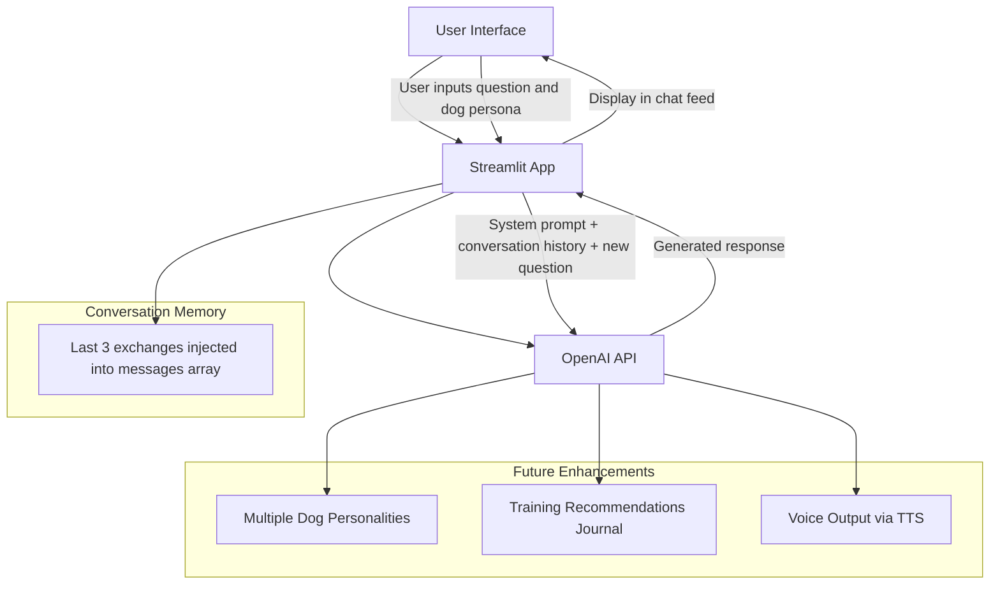

# Ask My Dog 🐶

**Ask My Dog** is a playful AI app that answers questions from the perspective of your dog, combining creativity with technical experimentation in AI-driven UX.

Users can:

* Ask their dog questions and get in-character responses
* Adjust the dog's persona, drama level, and storytelling style
* Follow along in a chat-style conversation feed
* Replay the last question with updated settings

This project demonstrates skills in:

* **Prompt engineering** – designing AI prompts for engaging dog personas
* **Persona design** – crafting distinct AI personalities with unique behaviors
* **Conversation memory** – maintaining context across multiple exchanges using OpenAI's messages array
* **Chat UX design** – building a message-feed interface with user/assistant bubbles
* **Streamlit app development** – rapid prototyping of web-based AI applications

**Live demo:** [\[Insert Link\]](https://ask-my-dog-syur5g5wj4wxkuke7xtk5p.streamlit.app/)

---

## Architecture Overview

---

## Features

* **Dynamic AI personas:** Fully editable dog profile including name, breed, age, energy level, training level, personality traits, and fear triggers
* **Drama level selector:** Four levels controlling how deeply the dog believes its own story — from Low to Extreme
* **Storytelling styles:** Five voice modes including Doggish Dog, Sitcom Dog, Shakespearean Dog, RPG Hero Dog, and Snoop Dogg Dog
* **Conversation memory:** The last 3 exchanges are passed into each API call so Luna remembers what was just discussed
* **Chat-style feed:** Questions appear as user bubbles on the right, dog responses appear as assistant bubbles on the left — styled like a messaging app
* **Trainer notes:** Each response includes a brief objective explanation of the dog behavior, shown below the dog's reply
* **Replay last question:** Re-runs the previous question with any updated settings applied
* **Persistent persona:** Dog profile can be saved to a local JSON file and reloaded across sessions

---

## How It Works

Each question triggers an OpenAI `chat.completions` call structured as:

1. **System message** — the full dog persona, drama rule, and style rule
2. **Conversation history** — the last 3 user/assistant exchange pairs injected in order
3. **User message** — the new question

This gives Luna short-term memory without requiring any database or external storage.

---

## Future Improvements

* Multiple dog profiles with a switcher dropdown
* Training tip journal — export all trainer notes as a PDF
* Voice output via OpenAI TTS so Luna speaks her answers
* Mood system — a "current mood" field that shifts responses dynamically
* Clear chat and download conversation buttons