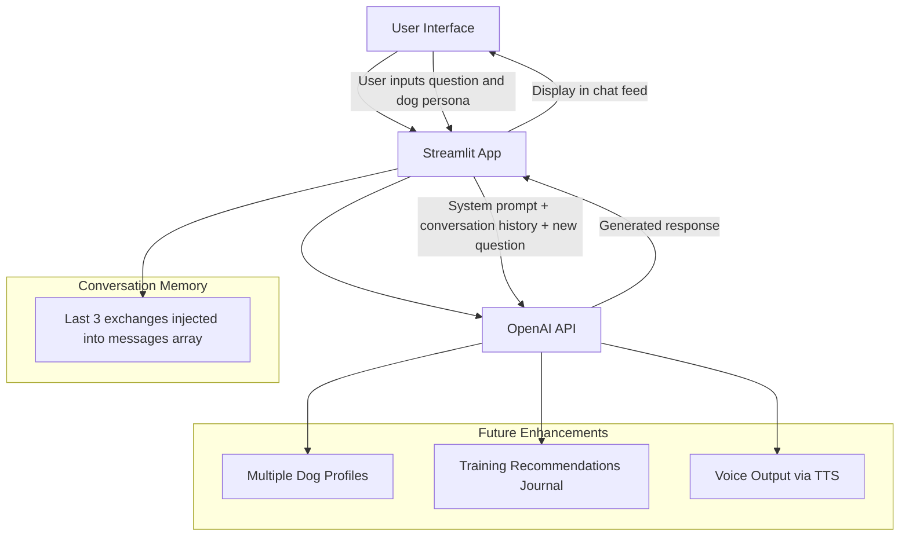

# Ask My Dog 🐶

**Ask My Dog** is a playful AI app that answers questions from the perspective of your dog, combining creativity with technical experimentation in AI-driven UX.

Users can:

* Ask their dog questions and get in-character responses
* Customize the dog's full persona including identity, intelligence, and nemesis
* Adjust drama level and storytelling style
* Follow along in a chat-style conversation feed
* Replay the last question with updated settings
* Discover hidden easter eggs

This project demonstrates skills in:

* **Prompt engineering** – designing AI prompts for engaging dog personas
* **Persona design** – crafting distinct AI personalities with unique behaviors
* **Conversation memory** – maintaining context across multiple exchanges using OpenAI's messages array
* **Chat UX design** – building a message-feed interface with user/assistant bubbles
* **Easter egg design** – embedding hidden triggers that override AI behavior mid-response
* **Streamlit app development** – rapid prototyping of web-based AI applications

**Live demo:** [ask-my-dog.streamlit.app](https://ask-my-dog-syur5g5wj4wxkuke7xtk5p.streamlit.app/)

---

## Architecture Overview

---

## Features

* **Dynamic AI personas:** Fully editable dog profile including name, breed, age, energy level, training level, personality traits, fear triggers, nemesis, and intelligence level
* **Self identity selector:** Nine dramatic preset identities (The Last Guardian, Apex Predator, The Chosen One, Exiled Royalty, Escape Artist, I Was Framed, Undercover Agent, Evil Genius, Chaos Incarnate) plus a Custom option. Each preset includes a hidden backstory that enriches the AI prompt without exposing complexity to the user
* **Intelligence slider:** Five-level scale from "Two brain cells fighting for third place" to "Plays 3D chess when you're not looking." Smartest is on the right
* **Nemesis field:** Freeform input for whoever (or whatever) the dog considers their arch enemy. Woven naturally into responses
* **Drama level selector:** Four levels controlling how deeply the dog believes its own story — from Low to Extreme
* **Storytelling styles:** Five voice modes including Doggish Dog, Sitcom Dog, Shakespearean Dog, RPG Hero Dog, and Snoop Dogg Dog
* **Conversation memory:** The last 3 exchanges are passed into each API call so the dog remembers what was just discussed
* **Chat-style feed:** Questions appear as user bubbles, dog responses appear as assistant bubbles
* **Trainer notes:** Each response includes a brief objective explanation of the dog behavior, shown below the reply
* **Replay last question:** Re-runs the previous question with any updated settings applied
* **Persistent persona:** Dog profile can be saved to a local JSON file and reloaded across sessions
* **Easter eggs:** Four hidden triggers that override normal AI behavior and unlock achievement banners

---

## Easter Eggs

Four hidden triggers are embedded in the app. Each one overrides the dog's current persona settings and fires a unique achievement banner:

| Trigger word | Achievement | Behavior |
|---|---|---|
| "squirrel" | 🐿️ Squirrel Brain | Starts answering, trails off mid-sentence, gone |
| "bath" | 🛁 The Ultimate Betrayal | Pure devastation. Trust is destroyed |
| "good dog" | 🐶 Bestest Doggo Ever Mode | All identity collapses into pure happy dog |
| "bad dog" | 😤 Pure Outrage | Self-identity activates dramatically |

Triggers fire even if the word appears mid-sentence (e.g. "why does my dog hate bath time").

---

## How It Works

Each question triggers an OpenAI `chat.completions` call structured as:

1. **System message** — the full dog persona including identity, hidden backstory, intelligence, nemesis, drama rule, and style rule
2. **Conversation history** — the last 3 user/assistant exchange pairs injected in order
3. **Easter egg override** — if a trigger word is detected, a SPECIAL OVERRIDE instruction is appended to the system prompt
4. **User message** — the new question

This gives the dog short-term memory and dramatic range without requiring any database or external storage.

---

## Future Improvements

* Multiple dog profiles with a switcher dropdown
* Training tip journal — export all trainer notes as a PDF
* Voice output via OpenAI TTS so the dog speaks its answers
* Mood system — a "current mood" field that shifts responses dynamically
* Clear chat and download conversation buttons