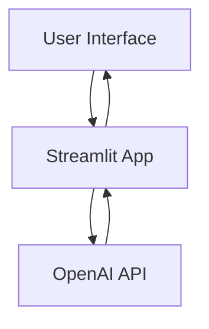
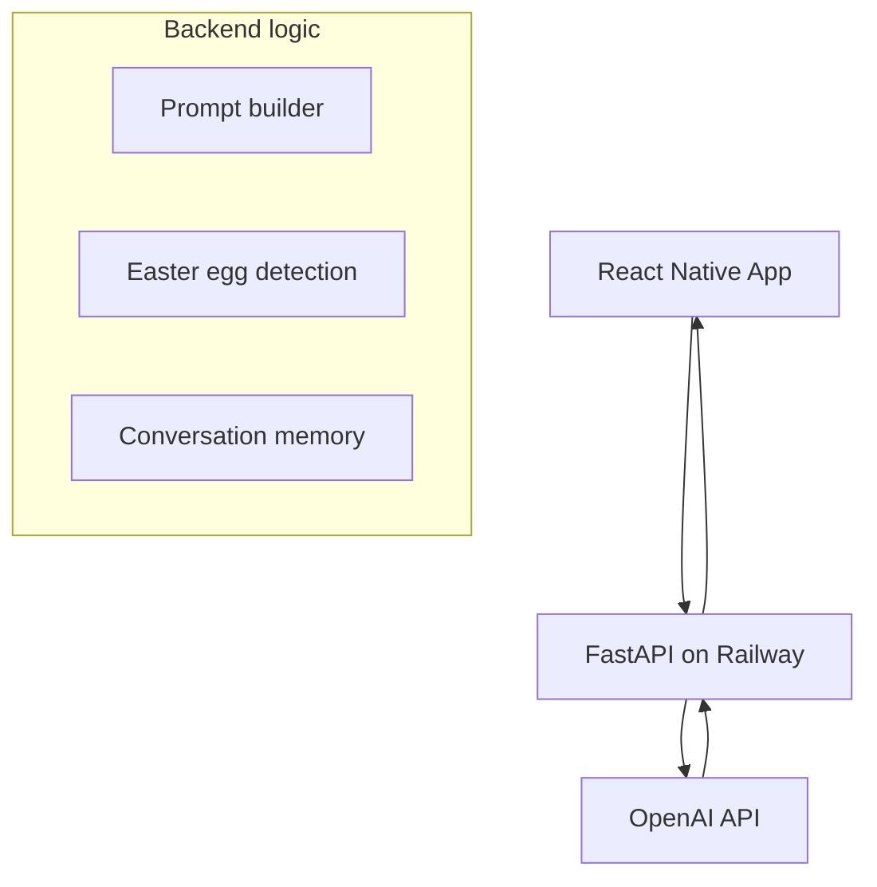

# Ask My Dog 🐶

**Ask My Dog** is a playful AI app that answers questions from the perspective of your dog, combining creativity with technical experimentation in AI-driven UX.

Users can:

* Ask their dog questions and get in-character responses
* Customize the dog's full persona including identity, intelligence, and nemesis
* Adjust drama level and storytelling style
* Follow along in a chat-style conversation feed
* Replay the last question with updated settings
* Discover hidden easter eggs

**Live demo:** [ask-my-dog.streamlit.app](https://ask-my-dog-syur5g5wj4wxkuke7xtk5p.streamlit.app/)

---

## Current State

The app is live as a Streamlit web app. A native iOS version is in final pre-submission polish.

### Streamlit App Stack
| Layer | Technology |
|---|---|
| UI + Backend | Streamlit + Python |
| AI | OpenAI GPT-4o-mini |

### Native App Stack
| Layer | Technology |
|---|---|
| Mobile UI | React Native + Expo |
| Backend | FastAPI (Python) |
| Hosting | Railway |
| AI | OpenAI GPT-4o-mini |

---

## Architecture

### Streamlit (Current)

### Native App

---

## Features

* **Dynamic AI personas:** Fully editable dog profile including name, breed, age, energy level, training level, personality traits, fear triggers, nemesis, and intelligence level
* **Self identity selector:** Nine dramatic preset identities plus a Custom option. Each preset includes a hidden backstory that enriches the AI prompt
* **Intelligence slider:** Five-level scale from "Two brain cells fighting for third place" to "Plays 3D chess when you're not looking"
* **Nemesis field:** Freeform input woven naturally into responses
* **Drama level selector:** Four levels controlling how deeply the dog believes its own story
* **Storytelling styles:** Five voice modes — Doggish, Sitcom, Shakespearean, RPG Hero, Snoop Dogg
* **Conversation memory:** Last 3 exchanges passed into each API call
* **Chat-style feed:** User and assistant bubbles
* **Trainer notes:** Brief objective explanation of dog behavior below each reply
* **Replay last question:** Re-runs the previous question with updated settings
* **Easter eggs:** Four hidden triggers that override AI behavior and unlock achievement banners
* **About tab:** Version number, feedback link, Venmo tip link, privacy policy and terms of use

---

## Easter Eggs

| Trigger | Achievement | Behavior |
|---|---|---|
| "squirrel" | 🐿️ Squirrel Brain | Trails off mid-sentence, gone |
| "bath" | 🛁 The Ultimate Betrayal | Pure devastation. Trust destroyed |
| "good dog" | 🐶 Bestest Doggo Ever Mode | Identity collapses into pure happy dog |
| "bad dog" | 😤 Pure Outrage | Self-identity activates dramatically |

---

## Native App Progress

### Complete
* Chat feed with user and dog bubbles
* Trainer notes
* Drama and storytelling style controls
* Conversation memory
* Dog persona editor connected live to chat
* Easter eggs with achievement banners
* Auto-scroll to latest message
* Keyboard fix — input stays visible when typing
* About tab with version number, feedback, Venmo link
* Privacy policy and terms of use hosted and linked
* Code pushed to GitHub

### In Progress
* App icon and splash screen
* App Store submission

---

## Future Improvements

* Dog expression images wired to identity and easter egg states
* Multiple dog profiles with a switcher
* Training tip journal — export trainer notes as PDF
* Voice output via OpenAI TTS
* Mood system — dynamic mood field that shifts responses
* Clear chat and download conversation buttons
* Easter egg animations
* Saved achievements