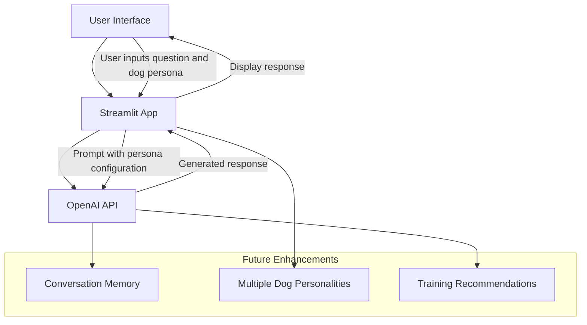

```mermaid
flowchart TD
    UI[User Interface] --> App[Streamlit App]
    App --> AI[OpenAI API]

    UI -->|User inputs question and dog persona| App
    App -->|Prompt with persona configuration| AI
    AI -->|Generated response| App
    App -->|Display response| UI

    subgraph Future Enhancements
        Memory[Conversation Memory]
        MultiDog[Multiple Dog Personalities]
        Training[Training Recommendations]
    end

    AI --> Memory
    App --> MultiDog
    AI --> Training
```